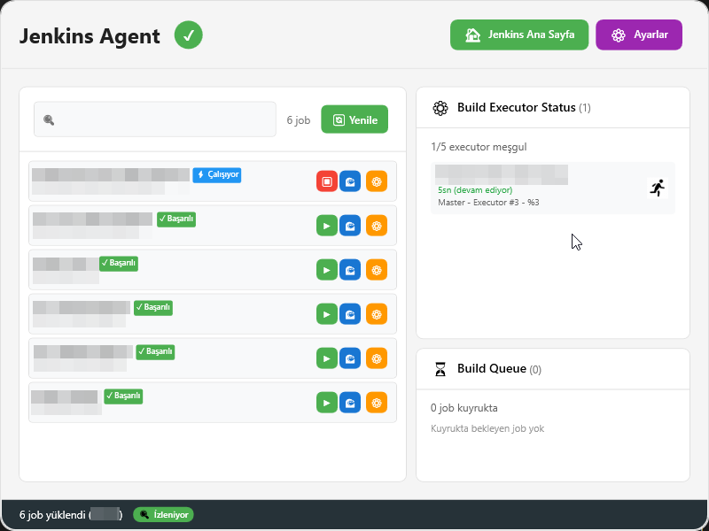
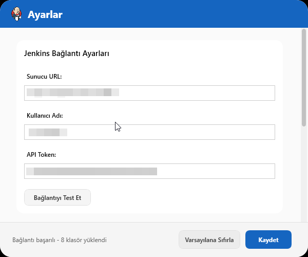

# 🚀 Jenkins Agent

Jenkins Agent, Jenkins sunucularını izlemek ve yönetmek için geliştirilmiş kullanıcı dostu bir WPF uygulamasıdır. Uygulama sayesinde Jenkins işlerinizi kolayca takip edebilir, durumlarını anlık olarak görüntüleyebilirsiniz.

## 📸 Ekran Görüntüleri

<p align="center">
  
</p>

<p align="center">
  
</p>

## 🛠️ Derleme (Build)
Projeyi derlemek için Visual Studio veya .NET CLI kullanabilirsiniz. Komut satırında aşağıdaki komutu çalıştırmanız yeterlidir:

```
dotnet build
```

## ▶️ Çalıştırma (Run)
Uygulamayı başlatmak için aşağıdaki komutu kullanabilirsiniz:

```
dotnet run
```

Alternatif olarak Visual Studio üzerinden F5 tuşu ile de çalıştırabilirsiniz.

## 📦 Kurulum Paketi (Release) Oluşturma
Kurulum paketi oluşturmak için iki yol kullanabilirsiniz:

### 🤖 Otomatik Yöntem (Tavsiye Edilen)

Proje klasöründe bulunan `release.ps1` PowerShell scriptini çalıştırın. Script, önce uygulamayı Release modunda derler, ardından Inno Setup ile kurulum dosyasını hazırlar:

```
pwsh ./release.ps1
```

### 📝 Manuel Yöntem

1. Uygulamayı Release modunda derleyin:
   ```
   dotnet build -c Release
   ```
2. Inno Setup 6 ile `JenkinsAgentSetup.iss` dosyasını derleyin:
   ```
   "C:\Program Files (x86)\Inno Setup 6\ISCC.exe" JenkinsAgentSetup.iss
   ```

Alternatif olarak VS Code'da tanımlı "Inno Setup: Compile Script" görevini de kullanabilirsiniz.

## ⚙️ Gereksinimler
- .NET 6 veya üzeri
- Jenkins sunucusu
- Inno Setup (sadece release için)

## �📄 Lisans
Bu proje [Apache License Version 2.0](LICENSE) ile lisanslanmıştır.